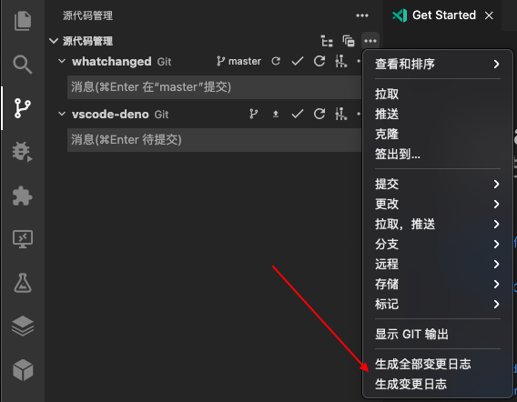

# vscode-whatchanged

vscode extension for [whatchanged](https://github.com/release-lab/whatchanged)

## Commands

| Command                 | description            |
| ----------------------- | ---------------------- |
| whatchanged.generate    | generate changelog     |
| whatchanged.generateAll | generate all changelog |

## License

The [Anti 996 License](https://github.com/release-lab/vscode-whatchanged/blob/master/LICENSE)
